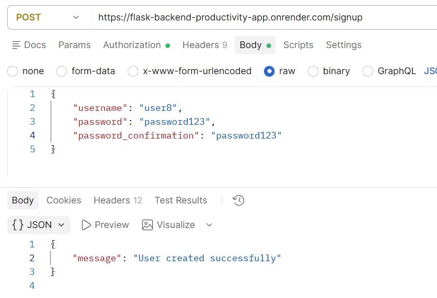

# 🔐 Full Authentication Flask Backend-Productivity App

## 📖 Project Description

The **Full Authentication Flask Backend-Productivity App** is a REST API built with Python, Flask, Flask-SQLAlchemy, Marshmallow, Flask-JWT-Extended, and SQLite, with PostgreSQL support for production
deployments.

The application provides secure user authentication and a workout productivity system. Users can create accounts, log in to receive a JWT access token, view their profile, and create, read, update, and delete
their own workout records.

## ✨ Main Features

* JWT-based authentication
* User registration and login
* Protected API endpoints
* Create, read, update, and delete workouts
* User-specific workout ownership
* Pagination for workout listings
* Input validation with Marshmallow
* Password hashing with Flask-Bcrypt
* SQLite database
* Database migrations with Flask-Migrate
* API testing with Postman and pytest
* Render deployment
* React frontend included in the repository

## 🌐 Live API

The deployed API is available at:

```
https://flask-backend-productivity-app.onrender.com
```

## 🛠️ Technologies Used

* Python
* Flask
* Flask-SQLAlchemy
* Flask-Migrate
* Flask-JWT-Extended
* Flask-Bcrypt
* Marshmallow
* SQLite
* PostgreSQL support with psycopg2-binary
* Pytest
* Gunicorn
* Render

## 📁 Project Structure

```text
full-authentication-flask-backend-productivity-app/
│
├── backend/
│   ├── app.py
│   ├── models.py
│   ├── schemas.py
│   ├── seed.py
│   ├── Pipfile
│   ├── Pipfile.lock
|   ├── Procfile
│   ├── README.md
|   ├── requirements.txt
|   ├── .env
│   ├── .gitignore
│   │
│   ├── instance/
│   │   └── app.db
│   │
│   ├── migrations/
│   │
│   └── tests/
│       ├── test_auth.py
│       └── test_workouts.py
│
└── frontend/
    └── client-with-jwt/
        ├── src/
        ├── public/
        ├── package.json
        ├── package-lock.json
        └── ...
```

## ⚙️ Installation

### 1️⃣ Clone the Repository

```bash
git clone https://github.com/KayteNjeri/full-authentication-flask-backend-productivity-app
cd full-authentication-flask-backend-productivity-app
```

### 2️⃣ Set up the Backend & Install Dependencies

Navigate to the backend directory:

```bash
cd backend
```

Install Pipenv:

```bash
pip install pipenv
```

Install the Python dependencies:

```bash
pipenv install
```

Activate the virtual environment:

```bash
pipenv shell
```

Verify Python version:

```bash
python --version
```

## 🗄️ Set up the Database

With the Pipenv shell active, Initialize the database migrations:

```bash
flask db init
```

Create the initial migration:

```bash
flask db migrate -m "Initial migration"
```

Apply the migration:

```bash
flask db upgrade
```

### 🌱 Seed the Database

Run:

```bash
pipenv run seed
```

The seed script creates sample users:

```bash
user1    password123
user2    password246
user3    password369
```

It also creates sample workouts for the three users.

⚠️ **Note:** The seed script clears existing users and workouts before inserting sample data. Running it will delete existing database data.

## ▶️ Running the Backend Application

From the `backend/` directory, start the Flask development server:

```bash
pipenv shell
pipenv run start
```

The local API will be available at:

```text
http://127.0.0.1:5000
```

## 🔐 Authentication

The API uses **JWT (JSON Web Tokens)** for authentication.

Signup

POST /signup

Example request:

```json
{
  "username": "newuser",
  "password": "password123",
  "password_confirmation": "password123"
}
```

Login

POST /login

Example:

```json
{
  "username": "user1",
  "password": "password123"
}
```

A successful login returns:

```json
{
  "user": {
    "id": 1,
    "username": "user1"
  },
  "token": "JWT_TOKEN"
}
```

Use the token on protected requests:

Authorization: Bearer JWT_TOKEN

## 🔑 API Endpoints

# 🏠 GET /

Returns a welcome message confirming that the API is running.

Authentication: Not required.

Response:

```json
{
  "message": "Welcome to the Workout Productivity API!"
}
```

# 📝 POST /signup

Creates a new user account.

Authentication: Not required.

Request body:

```json
{
  "username": "newuser",
  "password": "password123",
  "password_confirmation": "password123"
}
```

Success: 201 Created

```json
{
  "message": "User created successfully"
}
```

Possible errors:

400 -- Passwords do not match

409 -- Username already exists

422 -- Required fields are missing

# 🔐 POST /login

Authenticates a user and returns a JWT access token.

Authentication: Not required.

Success: 200 OK

```json
{
  "user": {
    "id": 1,
    "username": "user1"
  },
  "token": "JWT_TOKEN"
}
```

Possible errors:

403 -- Invalid credentials

422 -- Username or password is missing

# 👤 GET /profile

Returns the profile of the authenticated user.

Authentication: JWT required.

Authorization: Bearer JWT_TOKEN

Example response:

```json
{
  "user": {
    "id": 1,
    "username": "user1"
  }
}
```

# 🙋 GET /me

Returns the currently authenticated user.

Authentication: JWT required.

Example response:

```json
{
  "user": {
    "id": 1,
    "username": "user1"
  }
}
```

## 🏋️ Workout Endpoints

All workout endpoints require JWT authentication.

A user can only access workouts belonging to their own account.

# 📋 GET /workouts

Returns the authenticated user's workouts.

Supports pagination:

`/workouts?page=1&per_page=5`

Defaults:

`page=1`

`per_page=5`

`per_page maximum is 100`

Response includes:

```json
{
  "workouts": [],
  "pagination": {
    "page": 1,
    "per_page": 5,
    "total_pages": 1,
    "total_items": 1,
    "has_next": false,
    "has_prev": false
  }
}
```

# 🔎 GET /workouts/<workout_id>

Returns a specific workout belonging to the authenticated user.

Example:

GET /workouts/1
Authorization: Bearer JWT_TOKEN

If the workout does not exist or belongs to another user:

```json
{
  "message": "Workout not found"
}
```

Status: 404 Not Found

# ➕ POST /workouts

Creates a workout for the authenticated user.

Example request:

```json
{
  "date": "2026-09-13",
  "duration_minutes": 60,
  "notes": "Morning workout"
}
```

Success: 201 Created

```json
{
  "message": "Workout created successfully"
}
```

Validation rules:

`date is required`

`duration_minutes is required`

`Duration must be between 1 and 1440 minutes`

`notes is optional`

`notes has a maximum length of 255 characters`


# ✏️ PATCH /workouts/<workout_id>

Updates one or more fields of an existing workout.

Example:

`PATCH /workouts/1`
`Authorization: Bearer JWT_TOKEN`

```json
{
  "duration_minutes": 75,
  "notes": "Updated workout"
}
```

Success: 200 OK

```json
{
  "message": "Workout updated successfully"
}
```

# 🗑️ DELETE /workouts/<workout_id>

Deletes a workout belonging to the authenticated user.

Example:

`DELETE /workouts/1`
`Authorization: Bearer JWT_TOKEN`

Success: 200 OK

```json
{
  "message": "Workout deleted successfully"
}
```

## 📄 Pagination

The `GET /workouts` endpoint supports pagination.

Example:

```text
GET /workouts?page=1&per_page=2
```

Available pagination parameters:

* `page` — page number, starting from `1`
* `per_page` — number of workouts per page
* Maximum `per_page` value is `100`

Example response:

```json
{
  "workouts": [],
  "pagination": {
    "page": 1,
    "per_page": 2,
    "total_pages": 3,
    "total_items": 6,
    "has_next": true,
    "has_prev": false
  }
}
```

## 🔒 Authorization and User Data Ownership

Each workout belongs to the authenticated user through the `user_id` foreign key.

Protected workout queries always filter by both the workout ID and the authenticated user's ID.

This prevents one user from accessing, updating, or deleting another user's workouts.

For example:

```bash
workout = db.session.scalar(db.select(Workout).where(Workout.id == workout_id,Workout.user_id == user_id))
```

If a workout does not belong to the authenticated user, the API returns:

```json
{
  "message": "Workout not found"
}
```

with a `404` status code.

## 🧱 Database Models

### User

Fields:

* id
* username
* hashed_password
* relationship to workouts

Passwords are securely hashed using Flask-Bcrypt before being stored in the database.

### Workout

Fields:

* id
* date
* duration_minutes
* notes
* user_id
* created_at
* updated_at

Each workout belongs to one user, and a user can have multiple workouts.

## ✅ Validation

Marshmallow schemas validate incoming API data.

### Signup

* Username: required, 3--80 characters
* Password: required, minimum 6 characters
* Password confirmation: required

### Workout

* Date: required
* Duration: required, 1--1440 minutes
* Notes: optional, maximum 255 characters

The database also enforces a positive workout duration.

## 🧪 Tests

Automated tests are located in the:

`backend/tests/`

Run all tests:

```bash
pipenv run pytest
```

The test suite is intended to verify the Flask application's authentication, authorization, validation, and workout functionality.

The API can also be tested using Postman.

### 1️⃣ Register

Send:

```text
POST /signup
```

with:

```json
{
  "username": "user8",
  "password": "password123",
  "password_confirmation": "password123"
}
```

Sample response will be:




### 2️⃣ Login

Send:

```text
POST /login
```

with:

```json
{
  "username": "user8",
  "password": "password123"
}
```

Copy the returned `access_token`.

### 3️⃣ Authorize Requests

For protected endpoints, paste the access token on Token:

```text
Authorization: Bearer: <Token>
```

### 4️⃣ Test Workouts

You can then test:

* `GET /workouts`
* `POST /workouts`
* `GET /workouts/<id>`
* `PATCH /workouts/<id>`
* `DELETE /workouts/<id>`

## 📦 Sample Workout

Example request for creating a workout:

```json
{
  "date": "2026-09-13",
  "duration_minutes": 60,
  "notes": "Chest workout"
}
```

## 📦 Pipfile

The project uses Pipenv. The current Pipfile dependencies are:

```json
[[source]]
url = "https://pypi.org/simple"
verify_ssl = true
name = "pypi"

[packages]
alembic = "==1.20.0"
aniso8601 = "==10.0.1"
attrs = "==26.1.0"
bcrypt = "==5.0.0"
click = "==8.5.0"
faker = "==15.3.2"
flask = "==2.2.2"
flask-bcrypt = "==1.0.1"
flask-jwt-extended = "==4.7.4"
flask-migrate = "==4.0.0"
flask-restful = "==0.3.9"
flask-sqlalchemy = "==3.0.3"
greenlet = "==3.5.5"
gunicorn = "==26.2.0"
importlib-metadata = "==6.0.0"
importlib-resources = "==5.10.0"
iniconfig = "==2.3.0"
itsdangerous = "==2.2.0"
jinja2 = "==3.1.6"
mako = "==1.4.1"
markupsafe = "==3.0.3"
marshmallow = "==3.20.1"
packaging = "==26.3"
pluggy = "==1.6.0"
psycopg2-binary = "==2.9.13"
pyjwt = "==2.14.0"
pytest = "==7.2.0"
python-dateutil = "==2.9.0.post0"
python-dotenv = "==1.2.3"
pytz = "==2026.3.post1"
six = "==1.17.0"
sqlalchemy = "==2.0.52"
typing-extensions = "==4.16.0"
werkzeug = "==2.2.2"
zipp = "==4.1.0"

[dev-packages]

[requires]
python_version = "3.12"

[scripts]
start = "python app.py"
seed = "python seed.py"
```

Pipfile.lock stores the resolved dependency versions used by the project.

## 🚀 Deployment

The application is deployed as a Flask Web Service on **Render**.

### Production API

```text
https://flask-backend-productivity-app.onrender.com
```

The production server uses Gunicorn:

```bash
gunicorn app:app
```

Production secrets such as JWT_SECRET_KEY should be configured as Render environment variables and not stored in the repository.

## 🖥️ Frontend

The repository also contains a frontend/ directory with the React client.

The JWT frontend communicates with:

`POST /signup`
`POST /login`
`GET /me`

The JWT token is sent with protected requests using:

`Authorization: Bearer JWT_TOKEN`

## 📜 License

This project is licensed under the **MIT License**.

## 👩‍💻 Author

Built as a backend development project using Python, Flask, SQLAlchemy, JWT authentication, and SQLite.
